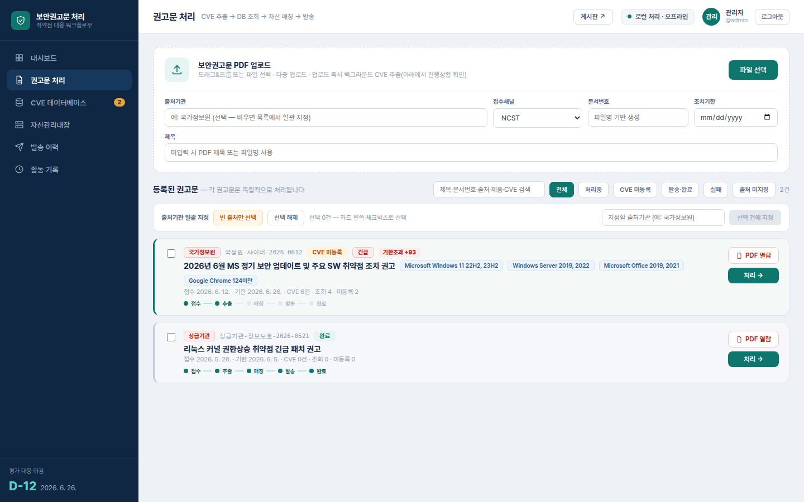
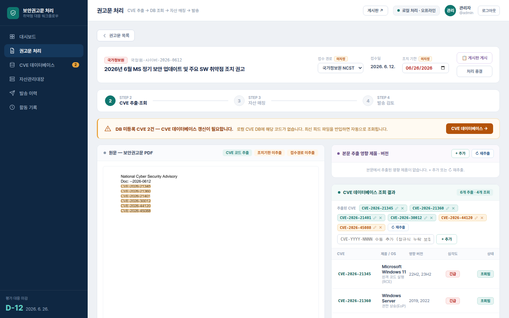
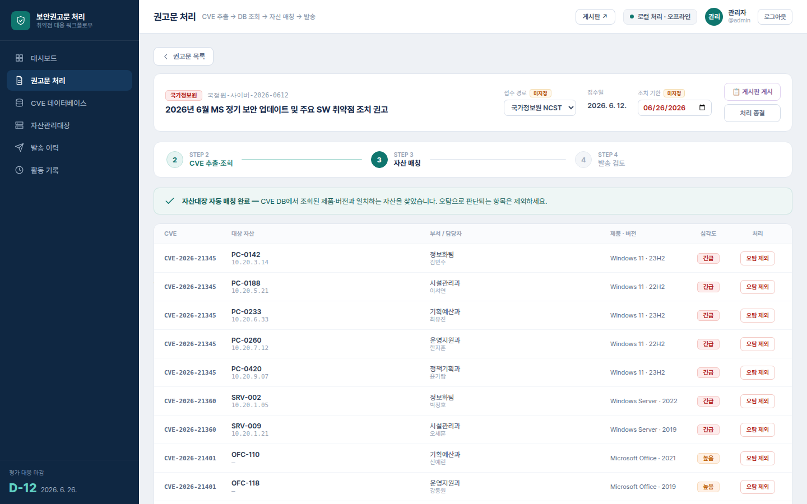
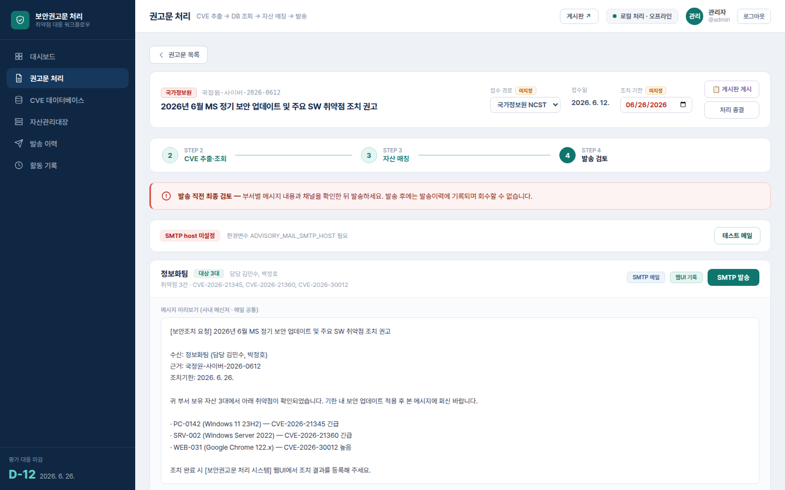
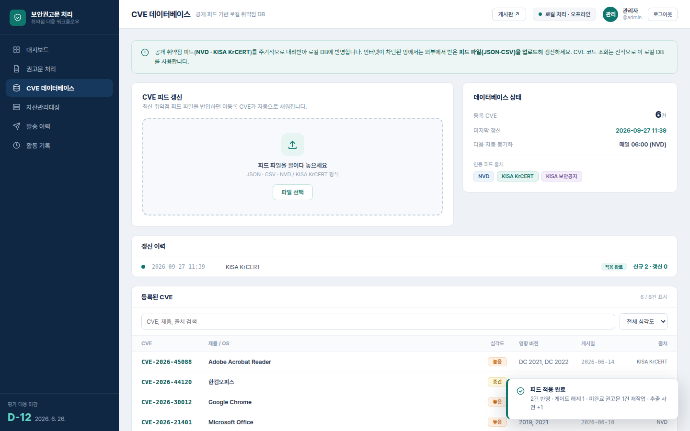
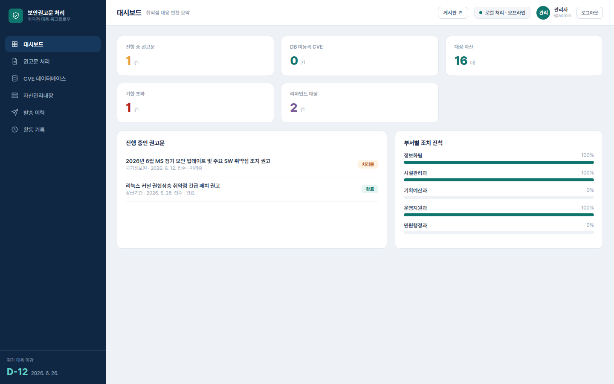
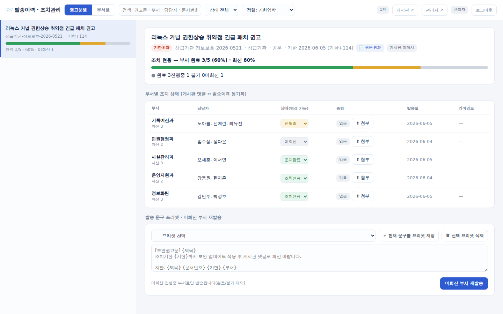
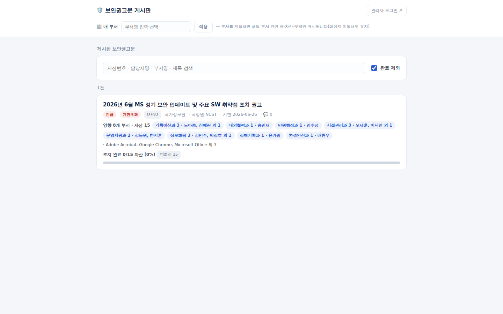

# Security Advisory Processing System

A web application for air-gapped networks that extracts CVEs (Common Vulnerabilities and Exposures) from security advisory PDFs (Portable Document Format), looks them up in a local vulnerability database (DB), finds affected assets, and asks the owning departments to remediate.

[한국어](README.md) | **English**


> All screens were captured from a real run with demo data loaded by `ADVISORY_SEED=true` (fictional departments, owners and 10.20.x.x addresses). The UI (user interface) itself is in Korean.

| Advisory list | STEP 2 · CVE extraction and lookup |
|---|---|
|  |  |
| **STEP 3 · Asset matching** | **STEP 4 · Dispatch review** |
|  |  |
| **CVE database · feed import** | **Dashboard** |
|  |  |
| **Dispatch history · remediation console** | **Internal board (no login)** |
|  |  |

## Features

- **Advisory upload and CVE extraction** — Upload a PDF; CVE IDs are extracted with regular expressions, and product / affected version / fixed version are read from tables first when the advisory has one. Missed CVEs or products can be added or edited in the UI.
- **Local CVE DB lookup** — Only the local DB is queried, no internet. If any CVE is missing from the DB, the server blocks asset matching (`409 NEEDS_CVE_UPDATE`).
- **CVE feed import** — Upload NVD (National Vulnerability Database) JSON (JavaScript Object Notation, 1.1 and 2.0), CSV (Comma-Separated Values), or KISA (Korea Internet & Security Agency) KrCERT (Korea Computer Emergency Response Team) files, validate, then apply. Applying fills missing CVEs and re-processes unfinished advisories.
- **Asset register import** — Preview an Excel file, choose the column mapping, then commit. Multiple sheets and custom fields are supported.
- **Asset matching** — A product normalization dictionary plus a version comparator (`23H2`, `2021`, `124 미만` = "below 124", `DC 2022`, ...) find affected assets. False positives can be excluded; the same asset/product pair is then suggested for exclusion on later advisories.
- **Per-department dispatch** — Builds a message per department and sends it via SMTP (Simple Mail Transfer Protocol) mail and messenger/groupware webhooks. Idempotency keys prevent duplicate sends; failures are recorded as `FAILED`.
- **Remediation tracking** — Department replies (done / in progress / not possible), evidence files, due-date reminders, and Excel/HTML (HyperText Markup Language) reports.
- **Internal board (`/board`)** — Anyone on the intranet can read published advisories without logging in and reply with remediation status in comments. Replies are synced back to the dispatch history.
- **Admin authentication** — Login, forced password change on first login, CSRF (Cross-Site Request Forgery) token, lockout after 5 failures, and an audit log.
- **Air-gapped deployment** — React and fonts are vendored so the browser makes no external requests, and dependencies install only from offline wheels. A Windows all-in-one bundle (with embedded Python) can also be built.

## Usage

### 1. Install

Python 3.11 or later is required. For an air-gapped target, first collect dependency wheels on a PC (personal computer) with internet access (same OS (operating system), CPU (central processing unit) and Python version as the target).

```bash
./scripts/prepare_offline.sh        # Windows: scripts\prepare_offline.bat
```

Copy the resulting `vendor/wheels/` folder together with the project folder to the target PC.

### 2. Run

```bash
chmod +x start.sh && ./start.sh     # Windows: start.bat
```

`start.*` creates `.venv`, installs dependencies only from `vendor/wheels`, and serves on `http://localhost:8000`. To install straight from PyPI (Python Package Index) on a development PC, run `ADVISORY_ONLINE_INSTALL=1 ./start.sh`.

To explore with demo data, enable seeding:

```bash
ADVISORY_SEED=true ./start.sh
```

Copy `.env.example` to `.env` to change settings (SMTP server, webhook URLs, data folder, etc.).

### 3. First login

1. On first start the console prints the admin account (`admin`) and a random password once. If `ADVISORY_BOOTSTRAP_PASSWORD` is set in `.env`, that value is used instead.
2. Open `http://localhost:8000/admin` and log in; you are taken to the password change screen. No other function works until the password is changed.

### 4. Advisory workflow

1. Upload a PDF in the **권고문 처리** (Advisory processing) menu. CVE extraction starts immediately.
2. Click **처리 →** (Process) on a card to open STEP 2 (CVE extraction and lookup). A warning appears if some CVEs are missing from the DB.
3. In the **CVE 데이터베이스** (CVE database) menu, choose a feed file and click **피드 적용 · DB 갱신** (Apply feed). With the demo data, `samples/krcert_cve_feed_2026-06-15.json` resolves the two missing CVEs.
4. In STEP 3 (asset matching), review the result and exclude false positives.
5. In STEP 4 (dispatch review), check each department's message and send. Without SMTP settings the send is recorded as `FAILED`.
6. Click **게시판 게시** (Publish to board) to publish on `/board`; department staff reply with remediation status in comments.
7. Use the **발송 이력** (Dispatch history) menu or the `/admin/history` console to follow progress per department, resend to departments that have not replied, and download reports.

API (Application Programming Interface) docs are at `http://localhost:8000/docs` while the server is running.

### 5. Tests

```bash
pip install -r requirements-dev.txt
pytest tests
python smoke_test.py
```

## Tech stack

| Area | Details |
|---|---|
| Languages | Python 3.11+ (all-in-one bundle ships embedded Python 3.12.10 / 3.13.7), JavaScript |
| Backend | FastAPI `>=0.111,<1.0`, Uvicorn `>=0.30,<1.0`, SQLAlchemy `>=2.0,<2.1`, Pydantic `>=2.6,<3.0`, python-multipart `>=0.0.9` |
| Document handling | pypdf `>=4.2,<6.0` (text), pypdfium2 `>=4.30,<5.0` (page rendering, table coordinates), openpyxl `>=3.1,<4.0` (Excel) |
| Database | SQLite (default, `data/advisory.db`) |
| Frontend | Build-less React 18.3.1 SPA (Single Page Application), Pretendard font — both vendored in `web/public/vendor/` |
| Tests | pytest `>=8.0`, httpx `>=0.27`, `smoke_test.py` |
| Deployment | `start.sh` / `start.bat` (offline wheel install), `build_allinone.py` (Windows amd64 all-in-one zip, optional 7z split) |
| Extra tools | `nvd_powershell_sync/` (PowerShell NVD sync), `.ds-build/` (Node.js + esbuild design-system bundle generator) |

## Documentation

- [Progress record](docs/PROGRESS.en.md) — final goal, verified feature status, work history
- [Detailed operations guide (Korean)](docs/상세_운영_가이드.md) — all-in-one bundle, auth and file access control, REST (Representational State Transfer) API list, environment variables, table extraction behavior, deployment checklist
- [Implementation record (Korean)](docs/구현_작업_기록.md)
- [Major overhaul plan (Korean)](docs/대규모_개편안.md)
- [Security review (Korean)](docs/security-review.md)
- [Testing guide (Korean)](docs/testing-guide.md)
- [NVD PowerShell sync tool (Korean)](nvd_powershell_sync/README-NVD-CVE-PowerShell-Sync.md)
- UI mockups: `mockups/`, design-system bundle: `ds-bundle/`
